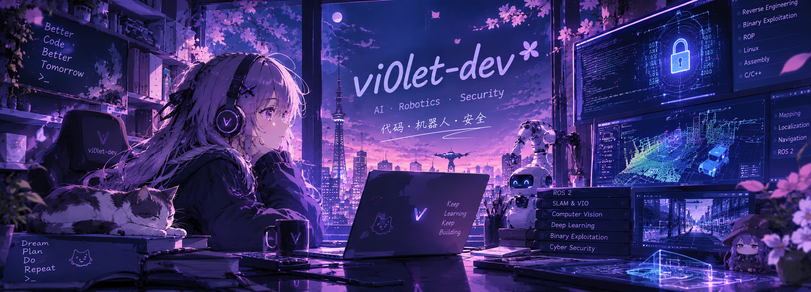

<div align="center">



<br>


</div>

---

## 🌌 About Me

```text
vi0let-dev

🎓 Graduate Student
🤖 AI & Robotics
🛡️ Binary Security
💻 C / C++ / Python
🐧 Linux
````

Interested in understanding how things work —
from **intelligent perception and autonomous robots**
to **binary programs and low-level systems**.

---

## 🧩 Interests

<div align="center">

|    🤖 AI & Robotics    | 🛡️ Binary Security | 💻 Development |
| :--------------------: | :-----------------: | :------------: |
|          ROS 2         | Reverse Engineering |     C / C++    |
|          SLAM          | Binary Exploitation |     Python     |
|     Computer Vision    |      PWN / ROP      |      Linux     |
| Intelligent Perception |       Assembly      |       Git      |

</div>

---

## 🛠️ Tech Stack

<div align="center">


</div>

---

<div align="center">

### 🌙

> **「コードを書いて、世界の仕組みを理解する。」**

`AI` · `Robotics` · `Security`

<br>


<br><br>

<sub>© 2026 vi0let-dev</sub>

</div>


